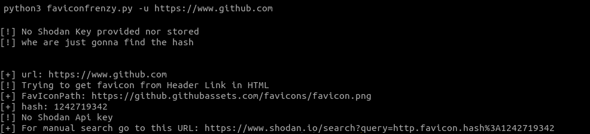
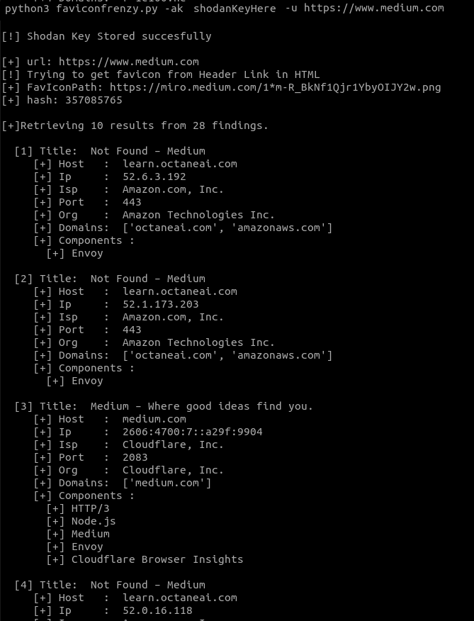
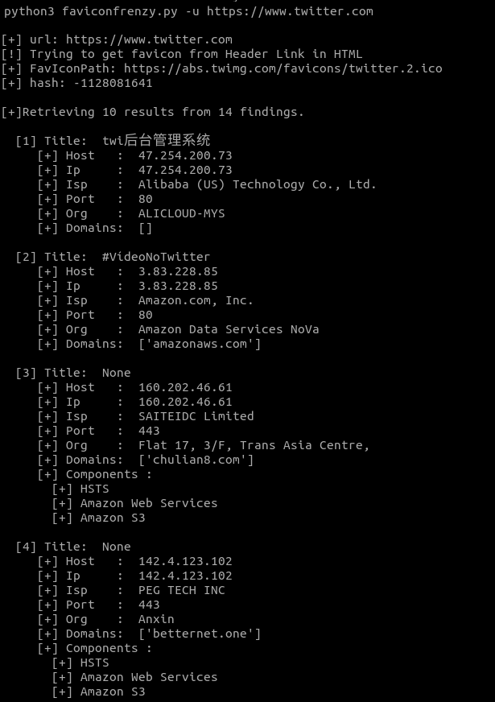

# FavIconFrenzy
Search for the provided URL FavIcon, no need to provide exact favicon url,  calculate the hash and send it to Shodan for analisys.
## Install
### First: Clone repository
```bash
git clone https://github.com/diegoespindola/faviconfrenzy
cd faviconfrenzy
```
### Second: Install requirements
```bash
python3 -m pip install -r requirements.txt
```
## Screenshots
### No Shodan key



### With Shodan key


### Previously stored Shodan key


## Usage
```
usage: faviconfrenzy [-h] [-u [URL]] [-ak [SHODANKEY]] [-t [TOPRESULTS]]

Search for the provided URL FavIcon, calculate the hash and send it to Shodan to find out other websites with the same FavIcon.

options:
  -h, --help            show this help message and exit
  -u [URL], --url [URL]
                        URL to search for the FavIcon.
  -ak [SHODANKEY], --addshodankey [SHODANKEY]
                        Store or replace the Shodan key in config file.
  -t [TOPRESULTS], --topresults [TOPRESULTS]
                        Max numer of results to show, default is 10.
```
